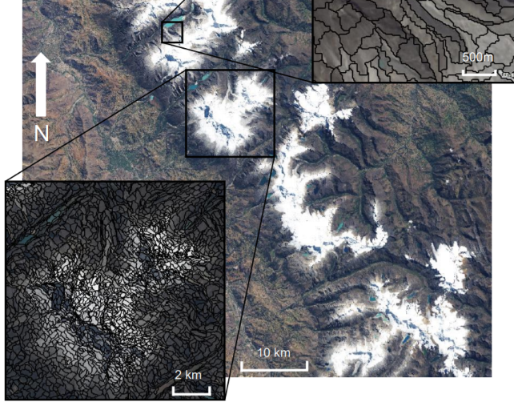
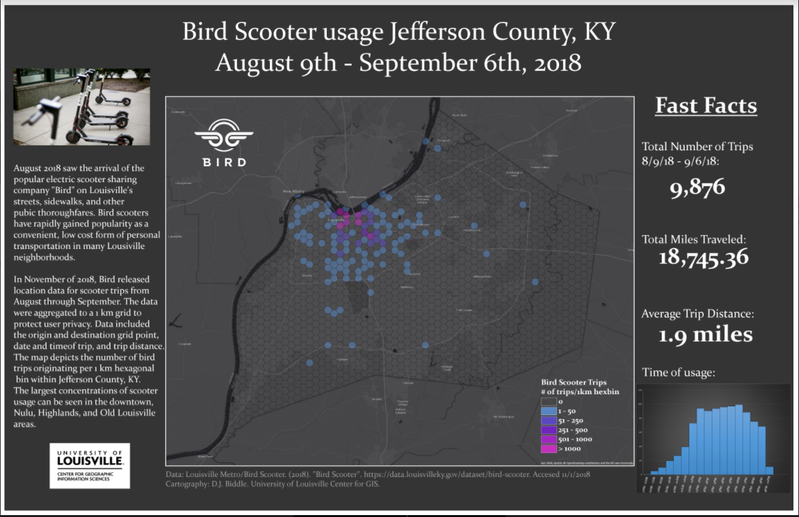
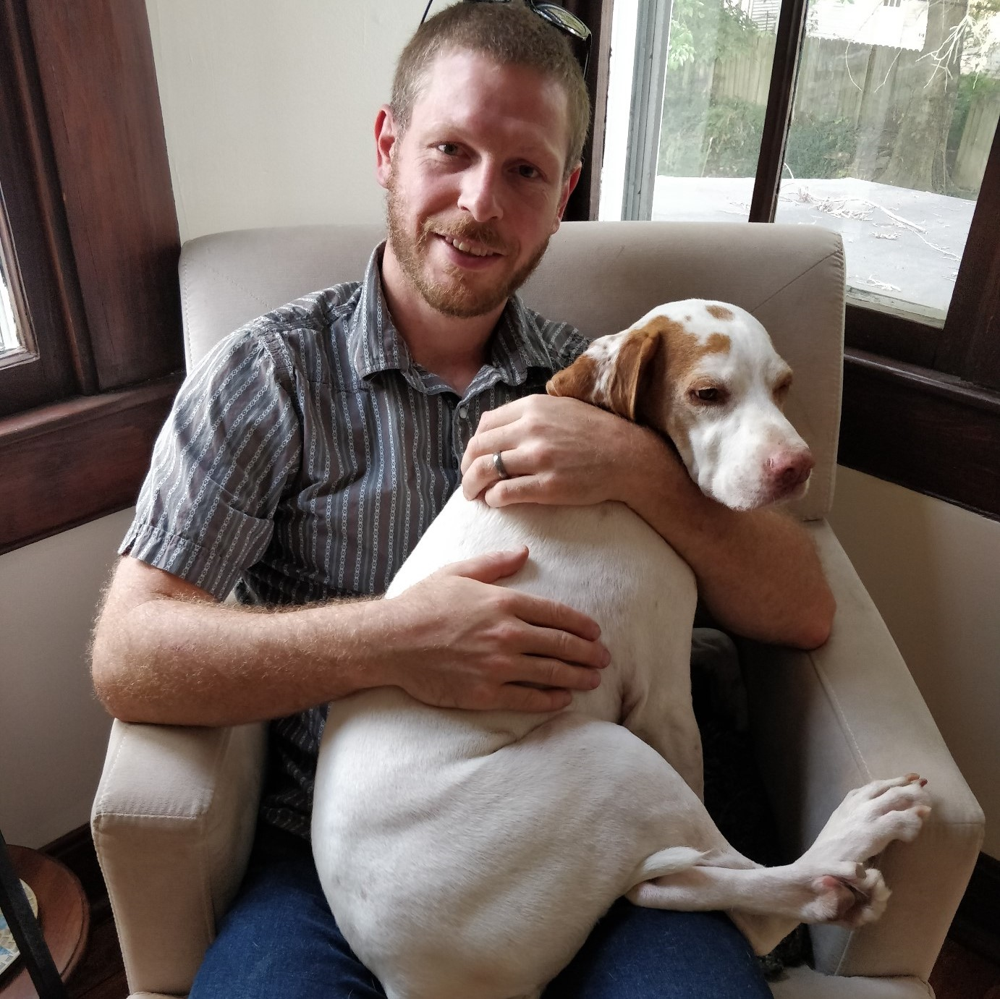

@title[A Place on Earth: Scholarship through Digital Mapping Initiatives]
A Place on Earth: Scholarship through Digital Mapping Initiatives 
-------------------------------
### @fa[globe fa-3x]
###### Trinity University, November 27th, 2018
###### D.J. Biddle, GISP
###### Use the @fa[angle-down] and @fa[angle-right] arrows to navigate
---
@title[The Plan]
#### The Plan
- About Me
- A Place on Earth?
- GIS and Remote Sensing Review
- Multidisciplinary Digital Mapping Initiatives

---
@title[The Plan]
#### The Plan
- **About Me**
- A Place on Earth?
- GIS and Remote Sensing Review
- Multidisciplinary Digital Mapping Initiatives
---
@title[About Me]
### About me...

@ul
- Staff GIS Technology Consultant
- University of Louisville Center for GIS
- 15 Years in GIS/Mapping
- Teach courses in GIS (including web mapping)
- Support research (faculty and student)
- Technical support to campus GIS users
@ulend
+++
@title[About Me]
### About Me
@css[fragment](I make maps...)@css[fragment](and web mapping applications...)@css[fragment](and wrangle spatial data...)@css[fragment](to create visualizations that tell a story about physical or social phenomena.)
+++
**Everything from glaciers in South America...**

+++
**To Bird Scooter usage in my hometown...**
 
+++
@css[fragment](**My training is in physical geography and geospatial technology...**)

@css[fragment](**but increasingly I work with folks outside my discipline**) 
+++
**Folks from...**
- Urban planning |
- Humanities |
- Engineering |
- Biology |
- Social work |
- Anthropology | 
- And more... |
+++
#### The Spatial Advantage
@css[fragment](Geographers know that where things happen, and how the locations of different people, events, and natural phenomenon relate to each other is KEY to understanding them.)

@css[fragment](Digital mapping and spatial thinking are being recognized as an essential component of projects that cross traditional disciplinary boundaries.) 
+++
#### Complete the following statement...
@css[fragment](Everything happens...) @css[fragment](SOMEWHERE!) 
+++

### How can digital mapping initiatives enhance teaching, research, and engaged scholarship? 
---
### A Place on Earth?
**Does anyone recognize this guy?**

+++
### A Place on Earth?
<ul>
 <li class="fragment">Kentucky Author Wendell Berry</li>
 <li class="fragment">Author, Professor, and Agronomist</li>
 <li class="fragment">Writes both fiction and non-fiction</li>
 <li class="fragment">Topics ranging from agricultural practices and the economy, relationships and community, racism, spirituality, etc.</li> 
 <li class="fragment">[*The Unsettling of America* (1977)](https://books.google.com/books/about/The_Unsettling_of_America.html?id=uSk9gAktmpQC)</li>
</ul>
+++
### A Place on Earth?
- Port William series of novel and short stories
- [*A Place on Earth*, 1967](https://books.google.com/books/about/A_place_on_earth.html?id=eVFaAAAAMAAJ) is the central novel in the series

+++
**Jayber Crow**

+++
### A Place on Earth?
- Writing evokes a strong sense of place |
- Land, and people's connection to it, is an essential part of the story...| 
@css[fragment](almost a character in its own right.)
+++
### A Place on Earth?
@css[fragment]("A Place on Earth" is the SOMEWHERE, where everything happens!)
---
### A Place on Earth?
> “I believe that the community - in the fullest sense: a place and all its creatures - is the smallest unit of health and that to speak of the health of an isolated individual is a contradiction in terms. (pg. 146, Health is Membership)”
> Wendell Berry, [The Art of the Commonplace: The Agrarian Essays](https://books.google.com/books/about/The_Art_of_the_Commonplace.html?id=K5j43sEr6xAC)
---
### GIS and Remote Sensing 
> @size[.6em](A geographic information system <GIS> is a framework for gathering, managing, and analyzing data. Rooted in the science of geography, GIS integrates many types of data. It analyzes spatial location and organizes layers of information into visualizations using maps and 3D scenes. ​With this unique capability, GIS reveals deeper insights into data, such as patterns, relationships, and situations—helping users make smarter decisions.) 
###### -Environmental Research Systems Institute (ESRI)
+++
@title[gis components]

+++
@title[gis database concept]

+++
@title[gis layers concept]

+++
@title[gis applications]

+++
@title[remote sensing basics]
#### Remote Sensing
> Remote sensing is the science and art of obtaining information about an object, area, or phenomenon through the analysis of data acquired by a device that is not in contact with the object, area, or phenomenon under investigation
- [Lillesand et al., 2015](https://www.wiley.com/en-us/Remote+Sensing+and+Image+Interpretation%2C+7th+Edition-p-9781118343289)
+++
@title[measurement from distance]
**What does that mean??**
@css[fragment](Hearing, seeing, smelling are all remote sensing, but here we focus on one kind: 
Measurement, by satellite-borne sensors (mostly), of the electromagnetic energy reflected or emitted from objects on the Earth’s surface.)
+++
@title[remote sensing platforms]

+++
@title[remote sensing platforms]

+++
@title[remote sensing platforms]

---
### Multidisciplinary Digital Mapping Initiatives
###### Humanities
- Recent move towards "Digital Humanities" |
- Digital Humanities Initiatives popping up all over the place! |
- What is Digital Humanities? |
+++
###### Digital Humanities
**A useful definition**
> @size[.6em]("The phrase Digital Humanities… describes not just a collective singular but also the humanities in the plural, able to address and engage disparate subject matters across media, language, location, and history. But, however heterogeneous, the Digital Humanities is unified by its emphasis on making, connecting, interpreting, and collaborating") 

- ["Digital Humanities"](https://mitpress.mit.edu/sites/default/files/titles/content/9780262018470_Open_Access_Edition.pdf), by Anne Burdick, Johanna Drucker, Peter Lunenfeld, Todd Presner, Jeffrey Schnapp
+++
**And another...**
> @size[.6em]("DH values collaboration, plurality, investigation of human culture, and the disruption of and reflection on traditional practices...the **use of digital technology for humanities projects changes the user’s experience**. The term “digital humanities” is very broad, and contains multitudes, but examples of “digital humanities” practices might include the **use of existing digital tools for research, to display data in new and revelatory ways, or to bring research to new audiences**.")

- [THATCamp LAC 2012](http://thatcamp.org/), from a collaborative [Glossary of Digital Humanities](https://docs.google.com/document/d/129_260mbp6C6JaqmylmhMTXA1sv7YYQ0OLsAOAOoCJE/edit?usp=sharing)
---
### Geohumanities
- Geography has recognized the intersection of humanities and spatial thinking, including digital mapping. 
- AAG's semiannual journal [*Geohumanities: Space, Place and the Humanities*](http://www.aag.org/cs/publications/journals/gh) stands as an example.
- **Storymapping** is a burgeoning tool for engaging audiences with humanities projects
+++
### Storymapping
> @size[.6em] Story Maps are **lightweight web applications** that mash up interactive GIS **maps**, photos/videos and other **multimedia content**, and text-based **narratives**, to tell a story about places or phenomena that are explicitly located in space and time. 
+++
### Storymapping
> @size[.6em] Story Maps leverage modern web development tools to provide an  **engaging, dynamic user experience** that grounds your story in its **geographic setting**.
+++
### Kentucky Black Freedom Map
- Collaboration between:
	- Geography/Center for GIS
	- History
	- Libraries/Archives and Special Collections
	- [KY Center for African American Heritage](https://kcaah.org/)
- Funding through the [Cooperative Consortium for Transdisciplinary Social Justice Research @ UofL](https://louisville.edu/socialjustice) 
+++
### Kentucky Black Freedom
##### The Idea
Create an interactive digital map highlighting a curated set of places with great significance to the Civil Rights struggle in Kentucky.
 
@css[fragment](A broad topic!)
+++
### Kentucky Black Freedom
##### The Process
- 1. Through conversations with the KCAAH and a broad literature review, establish a database of important Civil Rights sites. (History, Geography) |
- 2.  Categorize sites according to major themes related to the Civil Rights movement, e.g. housing, business, education, etc. (History) |
- 3. Write captions for each site that encapsulates its importance and ties to broader themes. (History) |  
- 4. Locate and procure compelling images related to sites to accompany map data and text.|
+++
### Kentucky Black Freedom
##### The Process
- 5. Geocode sites and ingest data into ArcGIS Online environment. (Geography) |
- 6. Organize, symbolize and configure maps for use in Story Maps platform. (Geography) |
- 7. Select optimal Story Map template for effective and engaging interactive map. (Geography) |
- 8. Build and configure Cascade Story Map, and host on https://kentuckyblackfreedom.org. (Geography) |
+++
### Kentucky Black Freedom
##### Tools Utilized
- Google Docs for project collaboration and documentation
- Google Sheets to compile site data and collaboratively edit captions, names, etc.
- ArcGIS Online for geocoding and hosting geospatial data
- ArcGIS Online for developing Web Maps, customizing cartographic layout (symbols, pop-ups, titles). 
- ESRI Story Maps Cascade Template for building final interactive mapping application.
- Reclaim Web Hosting for hosting https://kentuckyblackfreedom.org/map.

##### journalism/storytelling
- Story Maps convey place-based narratives about a topic or idea
- Mashups of maps, text, and multimedia in an interactive web applications
- Effective and engaging communication in a web browser
- https://storymaps.esri.com

+++
@title[story map example 1]
<iframe class="stretch" data-src="https://centerforgis.maps.arcgis.com/apps/Cascade/index.html?appid=08c2849d3f1649758e40b8cfa67d0248"></iframe>
+++
@title[story map example 2]
<iframe class="stretch" data-src="https://centerforgis.maps.arcgis.com/apps/MapSeries/index.html?appid=e7fd5854dbab435b944c27913df01980"></iframe>
+++
@title[story map example 3]
<iframe class="stretch" data-src="https://centerforgis.maps.arcgis.com/apps/Cascade/index.html?appid=307e73fffa6f4206b9d356459998b607"></iframe>
+++

---
@title[helpful links]
##### Some useful links
- http://www.louisville.edu/geogeo
- https://www.esri.com
- https://www.arcgis.com
- https://storymaps.arcgis.com
- https://storymap.knightlab.com/ (Open Source Story Mapping)
- https://qgis.org/ (Open Source Desktop GIS)
+++
@title[questions?]
### Any questions? 
Please email me at <djbidd01@louisville.edu>

	

 