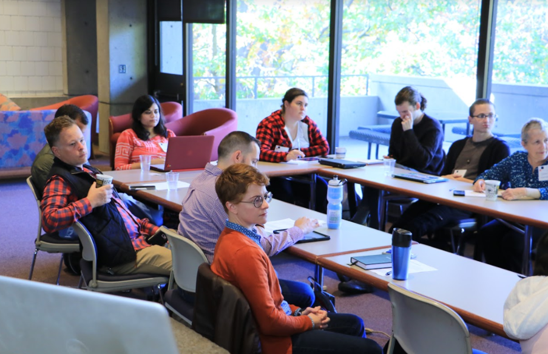
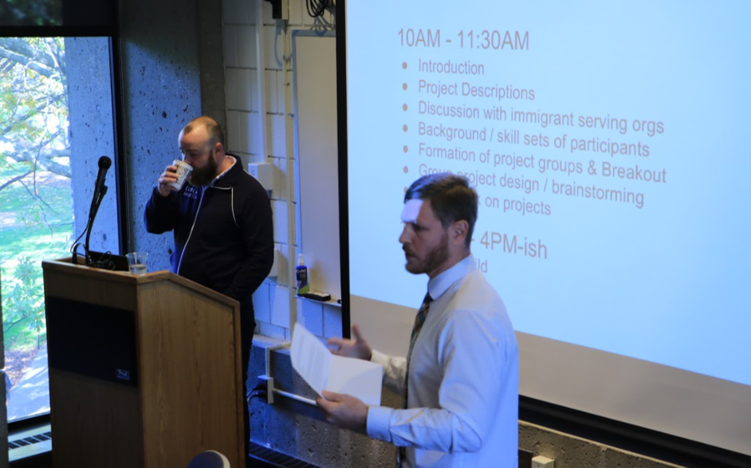

@title[A Place on Earth: Scholarship through Digital Mapping Initiatives]
A Place on Earth: Scholarship through Digital Mapping Initiatives 
-------------------------------
### @fa[globe fa-3x]
###### Trinity University, November 27th, 2018
###### D.J. Biddle, GISP
###### Use the @fa[angle-down] and @fa[angle-right] arrows to navigate
---

@title[The Plan]
#### The Plan
- About Me
- A Place on Earth?
- GIS and Remote Sensing Review
- Multidisciplinary Digital Mapping Initiatives
- Engaged Scholarship/Community Outreach
- Digital Mapping in the classroom
- Wrap-Up/More Resources
---

@title[The Plan]
#### The Plan
- **About Me**
- A Place on Earth?
- GIS and Remote Sensing Review
- Multidisciplinary Digital Mapping Initiatives
- Engaged Scholarship/Community Outreach
- Digital Mapping in the classroom
- Wrap-Up/More Resources
+++

@title[About Me]
### About me...

@ul
- Staff GIS Technology Consultant
- University of Louisville Center for GIS
- 15 Years in GIS/Mapping
- Teach courses in GIS (including web mapping)
- Support research (faculty and student)
- Technical support to campus GIS users
@ulend
+++

@title[About Me]
### About Me
@css[fragment](I make maps...)@css[fragment](and web mapping applications...)@css[fragment](and wrangle spatial data...)@css[fragment](to create visualizations that tell a story about physical or social phenomena.)
+++

**Everything from glaciers in South America...**

+++

**To Bird Scooter usage in my hometown...**
 
+++

@css[fragment](**My training is in physical geography and geospatial technology...**)

@css[fragment](**but increasingly I work with folks outside my discipline**) 
+++

**Folks from...**
- Urban planning |
- Humanities |
- Engineering |
- Biology |
- Social work |
- Anthropology | 
- And more... |
+++

#### The Spatial Advantage
@css[fragment](Geographers know that where things happen, and how the locations of different people, events, and natural phenomena relate to each other is KEY to understanding them.)

@css[fragment](Digital mapping and spatial thinking are being recognized as an essential component of projects that cross traditional disciplinary boundaries.) 
+++

#### Complete the following statement...
@css[fragment](Everything happens...) @css[fragment](SOMEWHERE!) 
+++

### How can digital mapping initiatives enhance teaching, research, and engaged scholarship? 
---

#### The Plan
- ~~About Me~~ 
- **A Place on Earth?**
- GIS and Remote Sensing Review
- Multidisciplinary Digital Mapping Initiatives
- Engaged Scholarship/Community Outreach
- Digital Mapping in the classroom
- Wrap-Up/More Resources
+++

### A Place on Earth?
**Does anyone recognize this guy?**

+++
### A Place on Earth?
<ul>
 <li class="fragment">Kentucky author Wendell Berry</li>
 <li class="fragment">Author, Professor, and Agronomist</li>
 <li class="fragment">Writes both fiction and non-fiction</li>
 <li class="fragment">Topics ranging from agricultural practices and the economy, relationships and community, racism, spirituality, etc.</li> 
 <li class="fragment">[*The Unsettling of America* (1977)](https://books.google.com/books/about/The_Unsettling_of_America.html?id=uSk9gAktmpQC)</li>
</ul>
+++

### A Place on Earth?
- Port William series of novel and short stories
- [*A Place on Earth*, 1967](https://books.google.com/books/about/A_place_on_earth.html?id=eVFaAAAAMAAJ) is the central novel in the series

+++

**Jayber Crow**

+++

### A Place on Earth?
- Berry's writing evokes a strong sense of place |
- Land, and people's connection to it, is an essential part of the story...| 
@css[fragment](almost a character in its own right.)
+++

### A Place on Earth?
> “I believe that the community - in the fullest sense: a place and all its creatures - is the smallest unit of health and that to speak of the health of an isolated individual is a contradiction in terms. (pg. 146, Health is Membership)”
> Wendell Berry, [The Art of the Commonplace: The Agrarian Essays](https://books.google.com/books/about/The_Art_of_the_Commonplace.html?id=K5j43sEr6xAC)
---

#### The Plan
- ~~About Me~~
- ~~A Place on Earth?~~
- **GIS and Remote Sensing Review**
- Multidisciplinary Digital Mapping Initiatives
- Engaged Scholarship/Community Outreach
- Digital Mapping in the classroom
- Wrap-Up/More Resources
+++

### GIS and Remote Sensing 
> @size[.6em](A geographic information system <GIS> is a framework for gathering, managing, and analyzing data. Rooted in the science of geography, GIS integrates many types of data. It analyzes spatial location and organizes layers of information into visualizations using maps and 3D scenes. ​With this unique capability, GIS reveals deeper insights into data, such as patterns, relationships, and situations—helping users make smarter decisions.) 
**-Environmental  Systems Research Institute (ESRI)**
+++

@title[gis layers concept]

+++

@title[gis database concept]

+++

@title[gis applications]

+++

@title[remote sensing basics]
#### Remote Sensing
> Remote sensing is the science and art of obtaining information about an object, area, or phenomenon through the analysis of data acquired by a device that is not in contact with the object, area, or phenomenon under investigation
- [Lillesand et al., 2015](https://www.wiley.com/en-us/Remote+Sensing+and+Image+Interpretation%2C+7th+Edition-p-9781118343289)
+++

@title[measurement from distance]
**What does that mean??**

@css[fragment](Hearing, seeing, smelling are all remote sensing, but here we focus on one kind...Measurement, usually by satellite-borne sensors, of the electromagnetic energy reflected or emitted from objects on the Earth’s surface.)
+++

@title[remote sensing platforms]

+++

@title[remote sensing platforms]

+++

@title[remote sensing platforms]

---

#### The Plan
- ~~About Me~~
- ~~A Place on Earth?~~
- ~~GIS and Remote Sensing Review~~
- **Multidisciplinary Digital Mapping Initiatives**
- Engaged Scholarship/Community Outreach
- Digital Mapping in the classroom
- Wrap-Up/More Resources
+++

### Multidisciplinary Digital Mapping Initiatives
###### Humanities
- Recent move towards "Digital Humanities" |
- Digital Humanities Initiatives popping up all over the place! |
- What is Digital Humanities? |
+++

###### Digital Humanities
**A useful definition**
> @size[.6em]("The phrase Digital Humanities… describes not just a collective singular but also the humanities in the plural, able to address and engage disparate subject matters across **media**, language, **location**, and history. But, however heterogeneous, the Digital Humanities is unified by its emphasis on making, connecting, interpreting, and collaborating") 

- ["Digital Humanities"](https://mitpress.mit.edu/sites/default/files/titles/content/9780262018470_Open_Access_Edition.pdf), by Anne Burdick, Johanna Drucker, Peter Lunenfeld, Todd Presner, Jeffrey Schnapp
+++

**And another...**
> @size[.6em]("DH values collaboration, plurality, investigation of human culture, and the disruption of and reflection on traditional practices...the **use of digital technology for humanities projects changes the user’s experience**. The term “digital humanities” is very broad, and contains multitudes, but examples of “digital humanities” practices might include the **use of existing digital tools for research, to display data in new and revelatory ways, or to bring research to new audiences**.")

- [THATCamp LAC 2012](http://thatcamp.org/), from a collaborative [Glossary of Digital Humanities](https://docs.google.com/document/d/129_260mbp6C6JaqmylmhMTXA1sv7YYQ0OLsAOAOoCJE/edit?usp=sharing)
+++

### Geohumanities
- Geography has recognized the intersection of humanities and spatial thinking, including digital mapping. 
- AAG's semiannual journal [*Geohumanities: Space, Place and the Humanities*](http://www.aag.org/cs/publications/journals/gh) stands as an example.
- **Storymapping** is a burgeoning tool for engaging audiences with humanities projects
+++

### Storymapping
> @size[.6em] Story Maps are **lightweight web applications** that mash up interactive GIS **maps**, photos/videos and other **multimedia content**, and text-based **narratives**, to tell a story about places or phenomena that are explicitly located in space and time. 
+++

### Storymapping
> @size[.6em] Story Maps leverage modern web development tools to provide an  **engaging, dynamic user experience** that grounds your story in its **geographic setting**.
+++

### Kentucky Black Freedom Map
- Collaboration between:
	- Geography/Center for GIS
	- History
	- Libraries/Archives and Special Collections
	- [KY Center for African American Heritage](https://kcaah.org/)
- Funding through the [Cooperative Consortium for Transdisciplinary Social Justice Research @ UofL](https://louisville.edu/socialjustice) 
+++

### Kentucky Black Freedom
##### The Idea
Create an interactive digital map highlighting a curated set of places with great significance to the Civil Rights struggle in Kentucky.
 
@css[fragment](A broad topic!)
+++

### Kentucky Black Freedom
##### The Process
- 1) Establish a database of important Civil Rights sites. (History, Geography) |
- 2) Categorize sites according to major themes related to the Civil Rights movement, e.g. housing, business, education, etc. (History) |
- 3) Write captions for each site that encapsulates its importance and ties to broader themes. (History) |  
- 4) Locate and procure compelling images related to sites to accompany map data and text.(Library Archives)|
+++

### Kentucky Black Freedom
##### The Process
- 5) Geocode sites and ingest data into ArcGIS Online environment. (Geography) |
- 6) Organize, symbolize and configure maps for use in Story Maps platform. (Geography) |
- 7) Select optimal Story Map template for effective and engaging interactive map. (Geography) |
- 8) Build and configure Cascade Story Map, and host on 	website. (Geography) |
+++

### Kentucky Black Freedom 
##### The Final Map
**https://kentuckyblackfreedom.org/kentucky-freedom-struggle/index.html**

<iframe class = "stretch" data-src = "https://kentuckyblackfreedom.org/kentucky-freedom-struggle/index.html"></iframe>
+++

### Kentucky Black Freedom
##### Tools Utilized

- [Google Docs](https://docs.google.com): project collaboration/documentation
- [Google Sheets](https://sheets.google.com): compile and collaboratively edit site data.
- [ArcGIS Online](https://www.arcgis.com): geocode and host geospatial data, develop Web Maps, customize cartographic layout (symbols, pop-ups, titles). 
- [ESRI Story Maps Cascade Template](https://storymaps.arcgis.com/en/app-list/cascade/): build final interactive mapping application.
- [Reclaim Web Hosting](https://reclaimhosting.com/) for website hosting.
+++

### Kentucky Black Freedom 
##### Lessons Learned
**Choosing what to include, and what to leave out is hard!**

@css[fragment]("If I had more time, I would have written a shorter letter" -Mark Twain)
+++

### Kentucky Black Freedom 
##### Lessons Learned
**Reconciling the creative vision of the team with the tools available can be difficult.**

@css[fragment](Don't let the perfect be the enemy of the good!)
+++

### Kentucky Black Freedom 
##### Lessons Learned
**Strive for visual simplicity** 

@css[fragment](Let the content speak for itself. The application should be intuitive, and should get out of the way.) 
--- 

### Literary Louisville
##### Mapping Literary Culture
- Collaboration with English Department
- Idea: Let's map **everything** related to literary culture in Louisville!
- Generate an extensive database which we can draw upon to build maps related to any theme we wish! 
+++

### Literary Louisville
- Place and space often play a key role in literary works
	- Explicitly (place is part of the story itself)
	- Implicitly (real world events and geography shape trajectory of literature in general)
+++

### Literary Louisville
- Phenomena associated with literature often have a location component
	- Events (whether real or fictional)
	- People (authors, characters, etc.)
	- Places (literary settings, libraries, publishing houses, theatres)
+++

### Literary Louisville
- What does “mapping the humanities” and in this case “Literary Louisville” look like? 
- What kinds of features are of interest? 
- What do we want to know about our data? How does it get recorded?
- What tools are available? 
- How can we manage and use the data collected? 
+++

### Literary Louisville
- How do we get from conceptual model → data model? 
	- Data attributes become fields in a table.
- Fields may have domains – lists or ranges of valid values for each attribute.
- Example: Literary Site Type:
	- Place
	- Event
	- Person
	- Text
	- Other
+++

### Literary Louisville
**Importance of well-designed data model**
- Insures data integrity through use of attribute domains
- Streamlines data entry in field by limiting manual data input 
- Specificity to analyze data at most granular level
- Comprehensiveness and flexibility to account for potentially irregular and non-conforming data (a catch-all)
+++

### Literary Louisville
**The solution**
 
+++

### Literary Louisville
**Database can be consumed in...**
- [ArcGIS Online](https://www.arcgis.com): web-mapping
- [ArcGIS Desktop](https://www.arcgis.com/desktop): data editing and analysis
- [Story Maps](https://storymaps.esri.com): crafting narratives from the database
- [ArcGIS Collector](https://www.esri.com/en-us/arcgis/products/collector-for-arcgis): field data collection and editing 
+++

### Literary Louisville
**ArcGIS Collector data collection**
 
+++

### Literary Louisville
**Data Applications**
Managing Little Free Library Locations
http://centerforgis.maps.arcgis.com/apps/StoryMapBasic/index.html?appid=87ddffdc66b44b88941202444c744af7
+++

### Literary Louisville
**Literary Story Maps**
http://centerforgis.maps.arcgis.com/apps/MapJournal/index.html?appid=7c3e27c2078f4e17a30b6b8b141998bc

http://centerforgis.maps.arcgis.com/apps/StorytellingSwipe/index.html?appid=f6f0e7b82f7d4d27a5f732cd386a956e
+++

### Literary Louisville
##### Lessons Learned
**If you build it, you must maintain it!**

@css[fragment](A database without a finite scope needs constant updating with new features, and removal of old ones...who is the steward?)
+++

### Literary Louisville
##### Lessons Learned
**Cloud-based data hosting has its advantages**

@css[fragment](Hosting the database on a local server allows for more functionality, but at the expense of failover capacity and downtime due to software updates and power outages)
+++

### Literary Louisville
##### Lessons Learned
**Start small and scale up**

@css[fragment](Focus on building simple, impactful applications rather than shooting for the moon)
---

### Multidisciplinary Digital Mapping Initiatives
##### Social Sciences

@css[fragment](**Just as there is a physical landscape of landforms, vegetation, and other features, there is also a social landscape of cities, neighborhoods, and people**)

@css[fragment](**What does that landscape look like?**) 

@css[fragment](**What are the contours of the social fabric? What processes cause them to form and to become reconstituted through time?**)
+++

### KIPDA Demographic Data Explorer
- Collaboration with the Kent School of Social Work
- Contracted by local planning agency to survey the landscape of social services and need in Louisville Metro. 
- Where are the services? Where is the need? **Where are the gaps?**
+++

### KIPDA Demographic Data Explorer
- Social services data from providers, aggregated to zip codes
- Demographic data from [US Census/American Community Survey](https://factfinder.census.gov/)
- Lightweight web application to explore the intersection of services and need.
+++

### KIPDA Demographic Data Explorer
- [ArcGIS Flexviewer](http://resources.arcgis.com/en/communities/flex-viewer/) App, running on [ArcGIS Server](https://enterprise.arcgis.com/en/server/) backend.
- Provides interactive variable mapping tools. 
**http://ulcgis.org/flexviewers/KIPDA_Map2018/**
+++

### KIPDA Demographic Data Explorer
##### Lessons Learned
**You must support your users**

@css[fragment](Offering an app with complex functionality means training people to use it!)
+++ 

### KIPDA Demographic Data Explorer
##### Lessons Learned
**Bite-sized insights vs. a buffet of data**

@css[fragment](Distill the information into actionable insights, rather than a kitchen sink approach)
+++

### KIPDA Demographic Data Explorer
##### Lessons Learned
**Technology always has a shelf-life**

@css[fragment](Standards change, app support ends. How will you keep your apps alive in the future?)
+++

### Multidisciplinary Digital Mapping Initiatives
##### Physical Sciences
**GIS and Remote Sensing are long standing tools for analyzing physical data, from the atmosphere, to the oceans, and between.**

@css[fragment](What advantages or solutions can web-based mapping render to existing practices?)
+++
### Belknap Campus Tree Mapping
- Collaboration of:
	- Geography
	- Biology
	- Sustainability
	- Physical Plant
- How can we efficiently map, measure, and manage our campus tree cover? 
+++
### Belknap Campus Tree Mapping
- Over 1,000 trees on UofL's Belknap campus.
- Great diversity of species, ages, and benefits (e.g. CO2 capture)
- Different actors looking at different pieces
	- Sustainability: How much CO2 is sequestered?
	- Biology: What phenological changes occur seasonally?
	- Physical Plant: When was a tree planted/removed/maintained? 
+++

### Belknap Campus Tree Mapping
- Geography students mapped tree locations with GPS devices.
- Biology grad students ID'ed trees and measured them (*canopy diameter, DBH, etc.)
- Sustainability calculated benefits from allometric data.
- Data are maintained in **one location** for all users and applications. 
+++

### Belknap Campus Tree Mapping

+++

### Belknap Campus Tree Mapping
- Database exposed to users through [Collector](https://www.esri.com/en-us/arcgis/products/collector-for-arcgis) and [ArcGIS Online](https://www.arcgis.com) Web Maps.
- Collector allows users to edit trees and update data values.
- Web Maps/Apps allow analysis and visualization.
-  http://centerforgis.maps.arcgis.com/apps/StoryMapBasic/index.html?appid=a62c8bd79cfc4556943b215c94842fb7
+++

### Belknap Campus Tree Mapping
##### Lessons Learned
**A working solution will spur new ideas**

@css[fragment](Seeing information on a map generates insights that spark creative/critical thinking.)
+++
### Belknap Campus Tree Mapping
##### Lessons Learned
**For complex datasets and applications, a robust solution is warranted**

@css[fragment](Sometimes the more sophisticated design is justifiable)
+++

#### The Plan
- ~~About Me~~
- ~~A Place on Earth?~~
- ~~GIS and Remote Sensing Review~~
- ~~Multidisciplinary Digital Mapping Initiatives~~
- **Engaged Scholarship/Community Outreach**
- Digital Mapping in the classroom
- More Resources
+++

### Engaged Scholarship &
### Community Outreach

**Can digital mapping projects support community works and help to affect social change?**

@css[fragment](How can we use digital mapping as a platform to empower people?)
+++

### National Safe Place Network
- Many non-profit organizations have spatial data and analysis needs, but lack resources.
- As GIS/Mapping professionals, we can help!
- Volunteering time and expertise 
+++

### National Safe Place Network
- NPSN manages federal grants for runaway and homeless youth programs and homes.
- Grantees all over the country
- Can we map grantees and look at some macro-level statistics about funding (by state, region, congressional district)?
- Serve in a web application for use by NPSN staff?
+++

### National Safe Place Network
 
+++

### National Safe Place Network
- Ongoing partnership to map their data and host apps
- Support their strategic initiatives
- Provide training to staff
+++

### National Safe Place Network
##### Lessons Learned
**What questions do people want answered?**

@css[fragment](Don't feed them techno-babble about the software. Ask them to form some basic "where?" questions)
+++

### National Safe Place Network
##### Lessons Learned
**Empower people. Help them take ownership of new ways of doing things**

@css[fragment](Show someone how to do something, instead of giving them the final product)
+++

### GIS Day Hackathon
- GIS Day celebrated worldwide each November
- How can GIS/digital mapping make a difference?
- Lots of smart people with various capacities
- Get them in a room together!
+++

### GIS Day Hackathon
**Provide space to let students, faculty, and community partners innovate, and create things that help address an issue.**

@css[fragment](Immigrant and refugee support and resources?)
+++

### GIS Day Hackathon

+++

### GIS Day Hackathon

+++

### GIS Day Hackathon

+++

### GIS Day Hackathon

+++

### GIS Day Hackathon

+++

### GIS Day Hackathon

+++

### GIS Day Hackathon

+++

### GIS Day Hackathon

+++

### GIS Day Hackathon

+++

### GIS Day Hackathon
##### Lessons Learned
**Be prepared**

@css[fragment](People are giving up their whole day! Provide them the framework and tools they need)
@css[fragment](Don't forget the coffee!)
+++

### GIS Day Hackathon
##### Lessons Learned
**Find champions for projects**

@css[fragment](Key in on folks who are passionate and can keep things moving...)@css[fragment](even after the event is over!)
+++

#### The Plan
- ~~About Me~~
- ~~A Place on Earth?~~
- ~~GIS and Remote Sensing Review~~
- ~~Multidisciplinary Digital Mapping Initiatives~~
- ~~Engaged Scholarship/Community Outreach~~
- **Digital Mapping in the classroom**
- More Resources
+++

### Integrating Digital Mapping into Teaching

**How can digital mapping improve teaching outcomes?**

@css[fragment](beyond traditional GIS/Remote Sensing courses) 
+++

### Building on existing applications
- Can Literary Louisville spur creativity in English courses?
- In ecology courses, can our campus tree database facilitate a "living lab"?
+++

### Campus Living Lab
- Build phenology database and relate it to tree database
- Each fall and spring, students record new observations of green up, budding, flowering, or color change.
- Each observation follows the tree in the database. 
- students use their phones with Collector to input data.
- Another data collection app: [EpiCollect](http://www.epicollect.net/)
+++

### Campus Living Lab

+++

### Story Maps
- For class projects in place of posters/group work
- Fun and engaging for students
- Teach basic digital skills (web-based GIS/Web Development)
- Encourage critical thinking
- [Story Maps 101](https://gitpitch.com/remoteSensorDJB/storymaps101): Workshop with live exercises in building Story Maps.
+++

### Story Maps
@title[story map example 1]
<iframe class="stretch" data-src="https://centerforgis.maps.arcgis.com/apps/Cascade/index.html?appid=08c2849d3f1649758e40b8cfa67d0248"></iframe>
+++

## Story Maps
@title[story map example 2]
<iframe class="stretch" data-src="https://centerforgis.maps.arcgis.com/apps/MapSeries/index.html?appid=e7fd5854dbab435b944c27913df01980"></iframe>
+++
### Story Maps
@title[story map example 3]
<iframe class="stretch" data-src="https://centerforgis.maps.arcgis.com/apps/MapJournal/index.html?appid=d7dc09ecf6644cd09c03afe60a833962"></iframe>
---

#### The Plan
- ~~About Me~~
- ~~A Place on Earth?~~
- ~~GIS and Remote Sensing Review~~
- ~~Multidisciplinary Digital Mapping Initiatives~~
- ~~Engaged Scholarship/Community Outreach~~
- ~~Digital Mapping in the classroom~~
- **More Resources**
+++

@title[helpful links]
##### More Resources
- https://www.esri.com
- https://www.arcgis.com
- https://storymaps.arcgis.com
- https://storymap.knightlab.com/ (Open Source Story Mapping)
- https://qgis.org/ (Open Source Desktop GIS)
- https://libguides.trinity.edu/c.php?g=52526&p=339784 
+++

@title[questions?]
### Any questions? 
Please email me at <djbidd01@louisville.edu>

	

